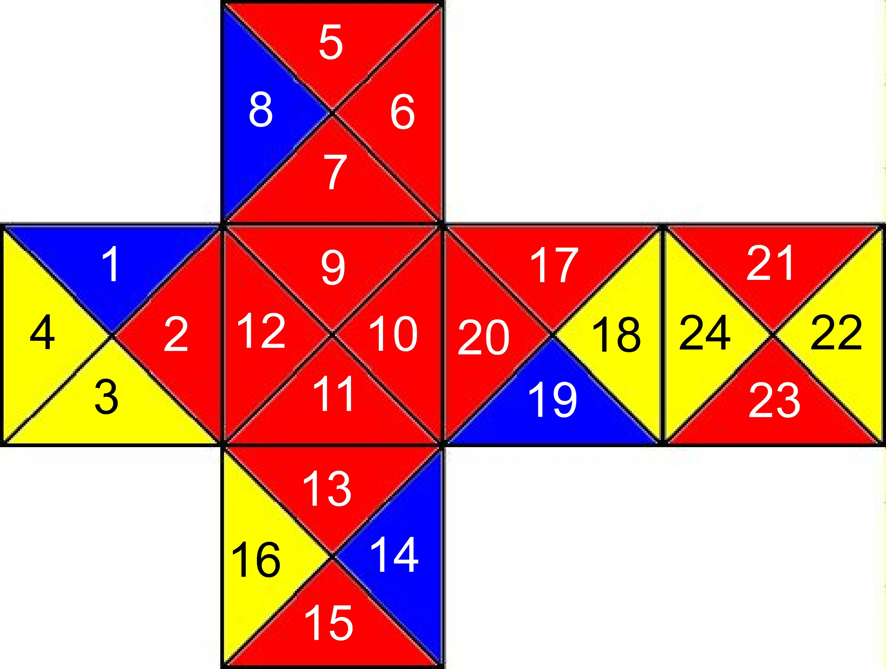

# 立體四方塊 · 4 Cube Puzzle（現代重製版）

> 2011 年國中科展研究《方塊圓舞曲─探討立體四方塊解法》的現代化重製。
> 原始研究：**張頌宇、謝荏全、蕭亦淳**。

把一份用 Dev-C++、Visual Basic、PhotoImpact、Freehand 完成的國中科展，
重寫成今天的樣子：**TypeScript 解法引擎 + Three.js 互動 3D 視覺化 + 現代 C++ + Markdown 文件**。



## 這是什麼遊戲？

四個正方體，每面用兩條對角線切成 4 個三角形，塗紅(R)/黃(Y)/藍(B)。
遊戲提供 **13 種立體圖形**玩法，要把四個方塊拼成指定形狀，
並讓所有**相接面的三角形顏色彼此相等**。詳見 [研究背景](docs/01-研究背景.md)。

## 專案結構

```
4-cube-puzzle/
├── docs/                  研究文件（Markdown + 圖片）
│   ├── 01-研究背景.md
│   ├── 02-方塊與規則.md
│   ├── 03-解法演算法.md
│   ├── 04-十三種圖形.md
│   └── 05-顏色排列研究.md
├── web/                   互動 3D 視覺化（Vite + TypeScript + Three.js）
│   ├── src/solver.ts        解法引擎（忠實重現原始 C++ 暴力窮舉）
│   ├── src/geometry.ts      方塊 24 三角形的 3D 幾何
│   ├── src/assembly.ts      依約束把四方塊組裝成立體外型
│   ├── src/study.ts         顏色排列研究頁 + 方塊套組設定（展開圖 / 3D 預覽）
│   ├── src/cubeset.ts       515,780 種套組產生器（編號 / 分步自訂、生成方塊資料）
│   └── public/data/puzzle-data.json   四方塊資料 + 13 圖形約束 + 解答數
└── color-study/           顏色排列研究（現代 C++，解出當年算不完的問題）
    ├── color_study.cpp      排列數：24 面如何排到四方塊（792,238,080）
    ├── combinations.cpp     組合數：本質不同的設計（515,780，Burnside）
    └── legacy/              2011 原始程式 + 忠實重寫（紀念）
```

## 快速開始

### 互動 3D 網頁

```bash
cd web
npm install
npm run dev      # 開發伺服器
# 或 npm run build && npm run preview
```

瀏覽器內三種模式：

- **觀看解答**：選 13 種圖形、瀏覽每一組解、即時 3D 組裝、旋轉縮放觀察相貼面如何對齊。
- **試玩**：自己旋轉 / 交換方塊，動手解解看。
- **排列研究**：顏色排列研究的結果與 24 個不同的面，並可從 **515,780 種「方塊套組」**中
  用編號或分步自訂選一組（預覽展開圖 / 3D），「套用」到觀看解答 / 試玩——換套組後解答數即時重算。

### 顏色排列研究（C++）

```bash
cd color-study
g++ -O2 -std=c++17 -o color_study color_study.cpp && ./color_study      # 排列數 792,238,080
g++ -O2 -std=c++17 -o combinations combinations.cpp && ./combinations   # 組合數 515,780
```

## 解答數（與原始研究對照）

| 圖形 | 難度 | 排列數 | 解法數 | 圖形 | 難度 | 排列數 | 解法數 |
|:---:|:---:|:---:|:---:|:---:|:---:|:---:|:---:|
| 一 | 初 | 40 | **20** | 八 | 高 | 44 | — |
| 二 | 初 | 3,400 | **1,700** | 九 | 高 | 54 | — |
| 三 | 中 | 134 | **134** | 十 | 高 | 36 | — |
| 四 | 中 | 63,296 | — | 十一 | 高 | 186 | — |
| 五 | 中 | 8 | **8** | 十二 | 高 | 496 | — |
| 六 | 高 | 4 | **4** | 十三 | 高 | 8 | — |
| 七 | 高 | 48 | — | | | | |

> 難度為原始研究分級：初級＝圖形 1、2；中級＝圖形 3、4、5；高級＝圖形 6～13。

> 「原始排列數」是程式窮舉（24⁴ 旋轉 × 24 排列 = 7,962,624 種嘗試）的結果；
> 「報告解法數」是作者再對圖形對稱性化簡後的數字。本重製版的引擎可重現所有已公布數字。
> 詳見 [十三種圖形](docs/04-十三種圖形.md)。

## 與當年的對照

| | 2011 原版 | 現代重製版 |
|---|---|---|
| 解法計算 | Dev-C++ / VS2010 暴力窮舉 | TypeScript（瀏覽器內即時運算） |
| 立體呈現 | Visual Basic 生成器（單向版／旋轉版） | Three.js 寫實 3D，可組裝、旋轉 |
| 圖形製作 | PhotoImpact / Freehand 10 | 程式即時產生幾何 |
| 顏色排列研究 | 36 層迴圈跑 3³⁶，跑不完 | 各方塊獨立枚舉 + 組合，毫秒解出（排列數 792,238,080、組合數 515,780） |
| 報告 | Word / PDF | Markdown |

## 授權與致謝

研究內容與圖片版權屬原作者所有。本重製版為教育與保存目的之現代化改寫。
