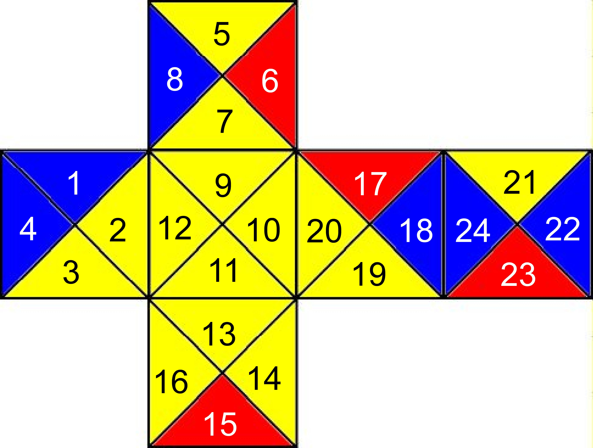
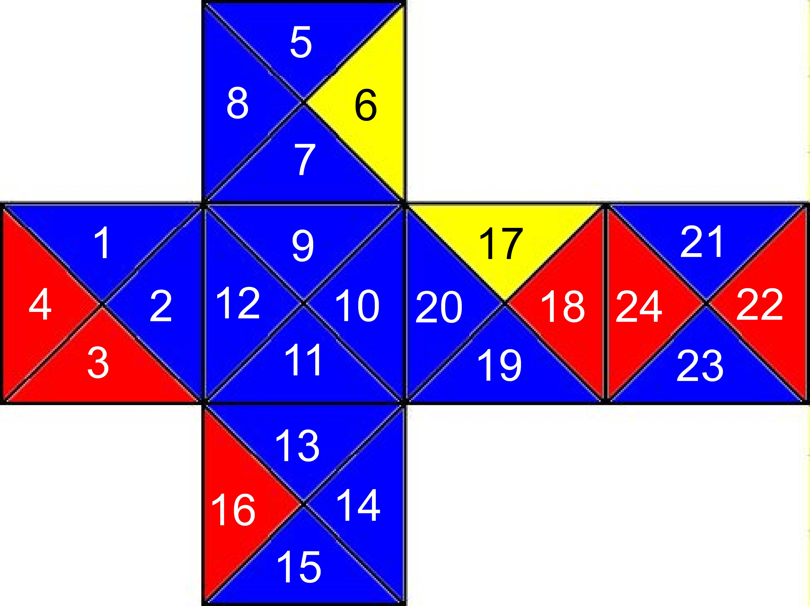
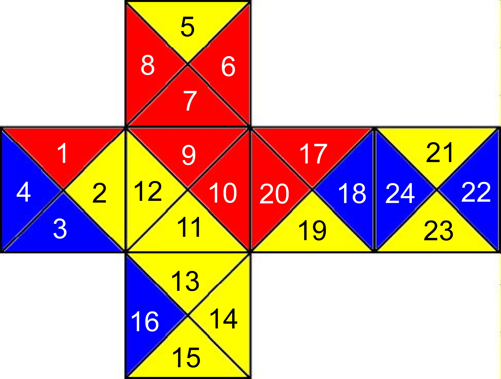
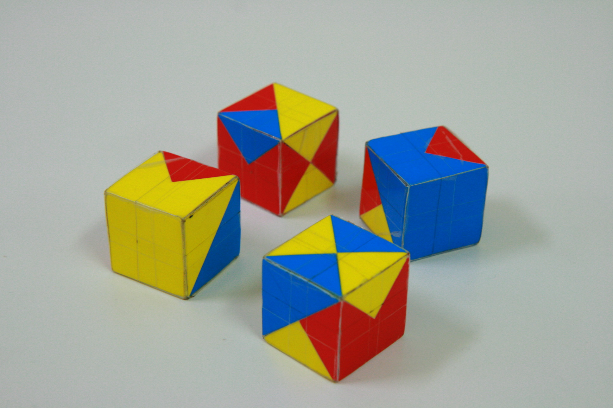
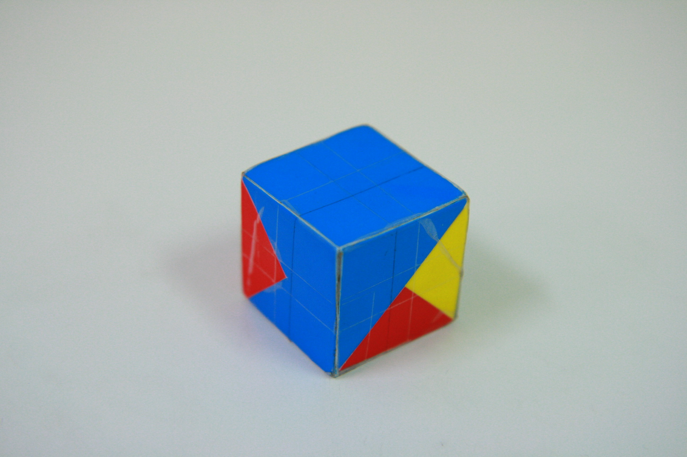

# 二、方塊與規則

## 名詞定義

每個方塊的側面都是正方形，將其**兩條對角線相連**後，會切割成 **4 個等腰直角三角形**，
每個三角形隨意塗上紅、藍、黃其中一種顏色。報告中以代號表示，並沿用於本重製版的程式：

| 顏色 | 代號 | 程式編碼 |
|------|:---:|:---:|
| 紅 red | R | **2** |
| 黃 yellow | Y | **1** |
| 藍 blue | B | **0** |

## 四個方塊：甲乙丙丁

研究發現，其中有三個方塊各有「**同一面四個三角形皆為同色**」的特徵，據此命名：

- **甲方塊**：有一面全為**紅**
- **乙方塊**：有一面全為**黃**
- **丙方塊**：有一面全為**藍**
- **丁方塊**：剩下的那一塊（無全色面）

下圖為甲方塊的展開圖，24 個三角形的**編號 1–24** 與顏色（本重製版的資料即以此為準）：


可以看到 **9、10、11、12 號三角形（同一面）全為紅色**——這就是甲方塊的「全紅面」。

四個方塊的展開圖：

| 甲（全紅面） | 乙（全黃面） |
|:---:|:---:|
|  |  |
| **丙（全藍面）** | **丁（無全色面）** |
|  |  |

實體紙模型：

| | |
|:---:|:---:|
|  |  |

## 三角形編號規則（程式表示法）

每個方塊有 6 個面、每面 4 個三角形 → 共 **24 個三角形槽位**，編號 1–24：

```
面 f（0..5）的 4 個三角形 = [4f+1, 4f+2, 4f+3, 4f+4]
```

每個方塊有 **24 種旋轉狀態**（正方體的旋轉對稱數），
故每個方塊的完整資料為 24 × 24 = **576** 個顏色值
（見 [`web/public/data/puzzle-data.json`](../web/public/data/puzzle-data.json)）。

## 遊戲規則

1. 把四個方塊拼成指定的**立體圖形**之一（共 13 種，見 [四、十三種圖形](04-十三種圖形.md)）。
2. 拼接時，**所有相接面上彼此接觸的三角形顏色必須相等**。
3. 滿足條件的擺法即為一組「解」。

每個圖形的擺法多達 **4! × 24⁴ = 7,962,624** 種（四方塊互換位置 × 各自 24 種旋轉），
其中能讓相接面全部同色的「解」寥寥可數，手動找非常困難——這正是要寫程式的原因。

→ 繼續閱讀：[三、解法演算法](03-解法演算法.md)
