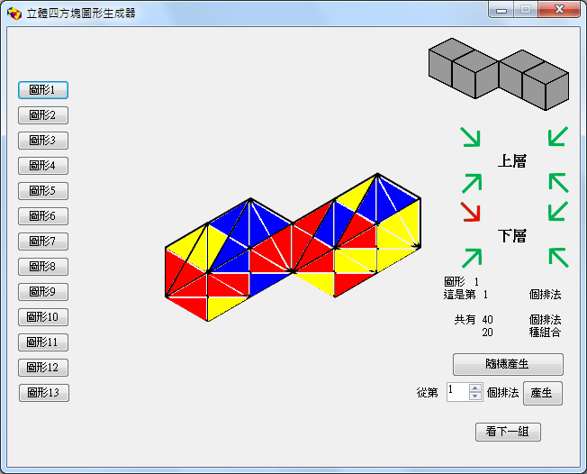

# 三、解法演算法

## 操作概念：先找「四等」對應

人工求解時，作者歸納出策略：先觀察該圖形有幾組「**四等**」（相接面四個邊都要顏色相等）
的接觸面，利用這些限制最強的面先定位，其餘再考慮相鄰邊的顏色對應；
高級圖形則先找出 **L 型**，再看剩下方塊能擺在哪。

## 系統化分析（手算）

對前幾個簡單圖形，作者用窮舉分類手算出解法數：

- 圖形 1：**20 組**
- 圖形 2：**1,700 組**
- 圖形 3：**134 組**

但更複雜的圖形組數太多，手算不可行——於是改用程式。

## C++ 暴力窮舉（原始程式）

### 核心想法

每個圖形都由四個方塊組成。四個方塊可以**互換位置**（4! = 24 種），
每個方塊各自可**旋轉**（每個正方體有 6 面 × 每面 4 種朝向 = **24 種旋轉**）。

```
總嘗試數 = 24⁴ (四方塊各自旋轉) × 24 (四方塊互換位置) = 7,962,624
```

程式跑遍這 ~796 萬種擺法，對每種檢查該圖形的「相接三角形顏色相等」約束。

### 原始程式長相

每個方塊預先存成 `int a[576]`（24 旋轉 × 24 三角形），四層迴圈 + 24 次排列呼叫
一個有著 96 個參數的 `f()` 來檢查約束。例如 L 型只需檢查一個相接面：

```cpp
void f(int a1,...,int d24) {
    if (a20==b2 && a17==b1 && a18==b4 && a19==b3) {  // 位置a的面4 ↔ 位置b的面0
        count++;
        printf(...);  // 印出這組解
    }
}
```

> 約束中的 `a17..a20 ↔ b1..b4` 表示「位置 A 的某面四個三角形」與
> 「位置 B 的某面四個三角形」對應相等（兩面相貼時呈鏡像對應）。

## 現代重寫（TypeScript）

[`web/src/solver.ts`](../web/src/solver.ts) 以等價邏輯重寫，**經驗證可重現原始程式所有解答數**：

```typescript
for (const perm of POSITION_PERMS) {          // 24 種「位置→實體方塊」指派
  const pos = { a: perm[0], b: perm[1], c: perm[2], d: perm[3] };
  const cc = constraints.map(([p1,t1,p2,t2]) => [pos[p1],t1,pos[p2],t2]);
  for (let oa=0; oa<24; oa++)                  // 四方塊各自 24 旋轉
   for (let ob=0; ob<24; ob++)
    for (let oc=0; oc<24; oc++)
     for (let od=0; od<24; od++) {
       // 檢查所有約束是否都成立 → 收集為一組解
     }
}
```

在現代瀏覽器中，每個圖形求解只需約 **300 毫秒**（當年要先編譯再跑、還要 `system("PAUSE")`）。

## 原始排列數 vs 報告解法數

程式數出的是**原始排列數**；對於有對稱性的圖形（如圖形 1、2），
每個本質解會被重複計數，作者再手動除以對稱倍數得到**報告解法數**：

| 圖形 | 程式原始排列數 | 報告解法數 | 倍率 |
|:---:|:---:|:---:|:---:|
| 1 | 40 | 20 | ÷2 |
| 2 | 3,400 | 1,700 | ÷2 |
| 3 | 134 | 134 | ÷1 |
| 5 | 8 | 8 | ÷1 |
| 6 | 4 | 4 | ÷1 |

> 本重製版兩個數字都會顯示，並在圖形清單標註。完整見 [四、十三種圖形](04-十三種圖形.md)。

## 圖像化：從 VB 生成器到 Three.js

當年用 Visual Basic 開發「立體四方塊生成器」把解法立體呈現，做了兩代：
**單向版**與**旋轉版**（旋轉版改以八個方向呈現）。



本重製版改用 **Three.js**：見 [`web/src/geometry.ts`](../web/src/geometry.ts)（24 三角形的立體幾何）
與 [`web/src/assembly.ts`](../web/src/assembly.ts)（依約束把四方塊組裝成立體外型，
相貼面因為是「解」必然顏色吻合）。

→ 繼續閱讀：[四、十三種圖形](04-十三種圖形.md)
